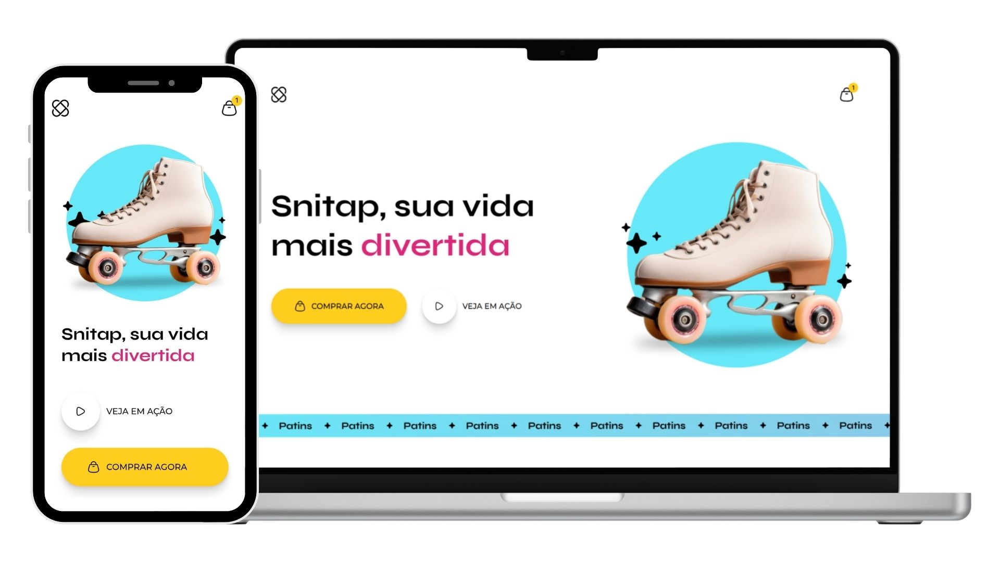

<h1 align="center">Snitap Patins</h1>

  Uma landing page moderna e animada para a marca <strong>Snitap Patins</strong>, que une estilo, movimento e diversão sobre rodas.

  

## 🚀 Tecnologias

Esse projeto foi desenvolvido com:

- HTML
- CSS (animações com @keyframes)

## 🎨 Interface no Figma

A interface foi construída com base no design do Figma.  
Você pode visualizá-lo clicando no link abaixo:

🔗 [Acessar protótipo no Figma](https://www.figma.com/design/BUX1MssfisD4LHoM3cr6T3/LP-de-patins-animada?node-id=3-376&p=f&t=FGy8eFB6CXTovlym-0)

## 💡 Sobre o projeto

O **Snitap Patins** é uma página criada para apresentar produtos de forma criativa e envolvente, com foco em **animações suaves**, **interatividade** e **design responsivo**.

 

> Esse projeto foi desenvolvido durante o curso da **Rocketseat**.
